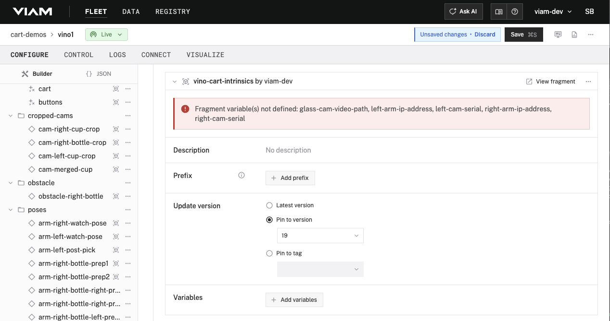
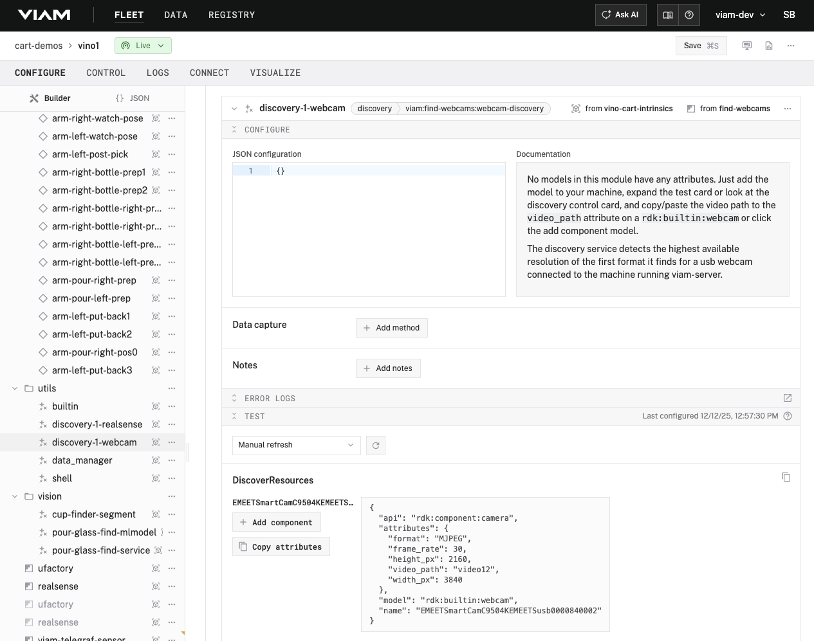
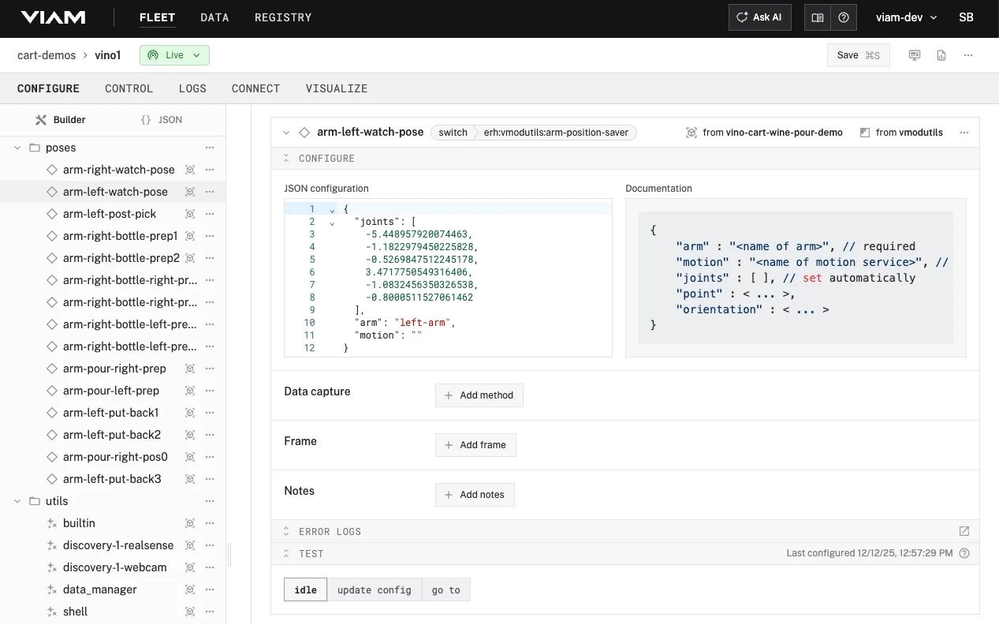

# Recipe: Wine pouring demo

## Overview

This recipe configures a dual-arm robot that autonomously pours wine. The left arm locates and picks up a wine glass from the table, the right arm grabs a wine bottle, and the two arms coordinate to pour wine into the glass. Computer vision detects the glass position and monitors the pour level. The complete sequence runs hands-free via Stream Deck buttons.

---

## Hardware

| Item | Qty |
|------|-----|
| UFactory xArm 6 with controller | 2 |
| UFactory xArm Gripper | 2 |
| Intel RealSense D435 | 2 |
| USB Webcam (1080p+) | 1 |
| Elgato Stream Deck (15-key) | 1 |
| Linux Computer (Ubuntu 22.04, 16GB+ RAM) | 1 |
| Network Switch | 1 |
| Ethernet Cables | 3 |
| USB 3.0 Cables | 2 |
| Stemless Wine Glass (~100mm dia, ~109mm tall) | 1 |
| Wine Bottle (~85mm dia, ~298mm tall) | 1 |

---

## Workspace

Mount both arms on a stable surface with enough range of motion for each arm to reach the glass, bottle, and pouring positions. Any table dimensions that accommodate this and keep all objects within reach will work.

For reference, our setup uses a table that is 1045mm wide × 705mm deep, with arms mounted 830mm apart (center to center).

---

## Step 1: Network the arms

Each xArm needs a static IP address on a local network with the Linux computer.

**1.1** Check the label on each arm's control box—the current IP address is probably printed there. If not, consult your arm's documentation.

**1.2** Connect your laptop directly to the first arm's control box via ethernet.

**1.3** Open xArm Studio and connect to the arm using the IP from the label.

**1.4** Go to **Settings → My Device → NetWork** and assign a static IP you'll remember (e.g., `192.168.1.200`).

**1.5** Repeat for the second arm, assigning a different IP (e.g., `192.168.1.212`).

**1.6** Connect both arms and your Linux computer to the network switch.

**1.7** Verify connectivity:

```bash
ping 192.168.1.200
ping 192.168.1.212
```

---

## Step 2: Identify the RealSense cameras

Each RealSense camera has a unique serial number.

**2.1** Connect both RealSense cameras to USB 3.0 ports on your Linux computer.

**2.2** Run:

```bash
rs-enumerate-devices | grep "Serial Number"
```

**2.3** You'll see output like:

```
Serial Number: 243322072782
Serial Number: 327122073386
```

**2.4** Identify which serial belongs to which camera by unplugging one and running the command again.

**2.5** Record your values.

---

## Step 3: Create the machine

**3.1** Go to [app.viam.com](https://app.viam.com) and sign in (or create an account).

**3.2** Create or select an organization and location.

**3.3** Click **+ Add machine** and name it `wine-pouring-demo`.

**3.4** Click **View setup instructions** and follow them to install viam-server on your Linux computer.

**3.5** Wait for the machine status to show **Connected**.

---

## Step 4: Add the pre-built hardware fragment

Fragments are reusable configuration blocks in Viam that let you share machine configurations across multiple machines. Instead of manually configuring each machine from scratch, you can create a fragment once and apply it to any number of machines—like a template or cookie cutter for robot configuration. Fragments can include components, services, modules, and all their settings. When you add a fragment to a machine, you can customize it using variables (for values that differ per machine, like IP addresses) while keeping the core configuration identical. If you update a fragment, all machines using it automatically receive the updated configuration.

**4.1** Go to the **CONFIGURE** tab.

**4.2** Click **+** → **Insert fragment**.

**4.3** Search for `vino-cart-intrinsics` and add it.

The `vino-cart-intrinsics` fragment configures the physical hardware for the wine pouring demo: both xArm 6 robot arms with their grippers, both Intel RealSense depth cameras, the webcam for pour monitoring, and the Stream Deck for manual control. It also includes utility services like the webcam discovery tool. This fragment uses variables for hardware-specific values—arm IP addresses, camera serial numbers, and the webcam video path—so you can deploy the same fragment to different setups by simply providing your own hardware identifiers.

**4.4** Scroll to the bottom of the Configure tab and click on the `vino-cart-intrinsics` fragment. 



**4.5** Click **Add variables** and paste this JSON, replacing the placeholder values with your own from Steps 1 and 2:

```json
{
  "left-arm-ip-address": "YOUR_LEFT_ARM_IP",
  "right-arm-ip-address": "YOUR_RIGHT_ARM_IP",
  "left-cam-serial": "YOUR_LEFT_CAM_SERIAL",
  "right-cam-serial": "YOUR_RIGHT_CAM_SERIAL",
  "glass-cam-video-path": "PLACEHOLDER"
}
```

**4.6** Click **Save**.

---

## Step 5: Discover the webcam video path

The webcam's video path varies by system. You'll use a discovery service (included in the fragment) to find it.

**5.1** Go to the **CONFIGURE** tab.

**5.2** Find the **utils** folder and expand it.

**5.3** Click on `discovery-1-webcam` to open its configuration.

**5.4** Scroll to the bottom and expand the **TEST** panel.

**5.5** The **TEST** panel will list available webcams and their video paths.



**5.6** Find your webcam in the list and note the video path (e.g., `video0`, `video2`).

**5.7** Find the hardware fragment variables (Step 4.4) and update `glass-cam-video-path` with the correct value.

**5.8** Click **Save**.

---

## Step 6: Add the pre-built wine-pouring application fragment

**6.1** Click **+** → **Insert fragment**.

**6.2** Search for `vino-cart-wine-pour-demo` and add it.

The `vino-cart-wine-pour-demo` fragment configures everything needed to run the pour sequence: the vision pipeline for detecting glasses (including ML models and point cloud segmentation), the obstacle definitions that keep the arms from colliding with the table and walls, all the saved arm poses used during the pour choreography, and the vinocart orchestration service that coordinates the complete demo. This fragment references components defined in the hardware fragment by name, which is why variables like `left-arm-name` and `left-cam-name` map the application logic to your specific hardware configuration.

**6.3** Click **Add variable** and paste this JSON:

```json
{
  "glass-cam-name": "cam-glass",
  "cup-width": 100,
  "bottle-height": 298,
  "right-camera": "right-cam",
  "left-arm-name": "left-arm",
  "left-camera": "left-cam",
  "left-cam-name": "left-cam",
  "right-arm-name": "right-arm",
  "left-gripper-name": "left-gripper",
  "right-gripper-name": "right-gripper",
  "cup-height": 109
}
```

**6.4** Click **Save**.

---

## Step 7: Verify components

**7.1** Go to the **CONTROL** tab.

**7.2** Confirm all components show connected (green):

- `left-arm`
- `right-arm`
- `left-cam` (shows video feed)
- `right-cam` (shows video feed)
- `cam-glass` (shows video feed)

**7.3** Test each arm by sending small joint movements from the control panel.

---

## Step 8: Explore the configuration

In the **CONFIGURE** tab, notice the folders that organize the components and services. Here's what each contains:

| Folder | Contents |
|--------|----------|
| **hardware** | Arms, cameras, grippers—the physical devices. Each has a **TEST** panel at the bottom of its configuration where you can view camera feeds and move arms. |
| **obstacles** | Virtual boundaries that prevent the arms from colliding with the table, walls, and each other during motion planning. |
| **poses** | Saved arm positions used in the pour sequence (watch pose, pour prep, etc.). Each pose has a **TEST** panel with a **go to** button. |
| **utils** | Utility services including `discovery-1-webcam`, which you used in Step 5 to find your webcam's video path. |

**8.1** Find the **poses** folder and expand it.

**8.2** Click on `arm-left-watch-pose` to open its configuration.

**8.3** Scroll to the bottom and expand the **TEST** panel.



**8.4** Click **go to**. The left arm moves to its watch position.

**8.5** Repeat for `arm-right-watch-pose`—open it, expand the **TEST** panel, and click **go to**.

This confirms the arms are configured correctly and can reach their saved positions.

---

## Step 9: Run the demo

### Safety

- Clear a 2-meter radius around the arms
- Know where arm power switches are located
- Place the wine glass on the table within camera view
- Place the bottle within reach of the right arm

### Stream Deck controls

| Button | Color | Action |
|--------|-------|--------|
| Full Demo | Green | Run complete pour sequence |
| Touch | Purple | Pick up glass |
| Prep | Purple | Position arms for pour |
| Pour | Purple | Pour wine |
| Put Back | Purple | Return glass and bottle |
| Reset | Orange | Return to start position |
| Stop | Red | Not currently functional |

### Test sequence

1. Press **Reset**—arms move to home position
2. Press **Touch**—left arm finds and picks up glass
3. Press **Prep**—both arms position for pour
4. Press **Pour**—right arm tilts bottle
5. Press **Put Back**—arms return items

### Full demo

Press **Full Demo** to run the complete sequence automatically.

---

## Troubleshooting

| Problem | Solution |
|---------|----------|
| Arm won't connect | Verify IP with `ping`; confirm xArm Studio connects |
| Camera not found | Check USB 3.0 port; verify serial number matches |
| Webcam not listed | Run discovery again; try different USB port |
| Glass not detected | Improve lighting; check `cam-glass` view in CONTROL |
| Motion fails | Press Reset and retry; check for obstacles in workspace |

**Emergency stop:** Press the red stop buttons on the arms.


